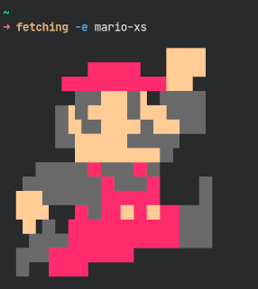
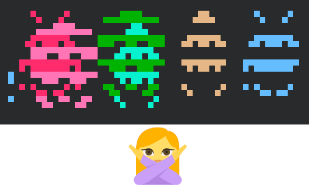
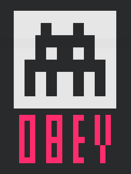
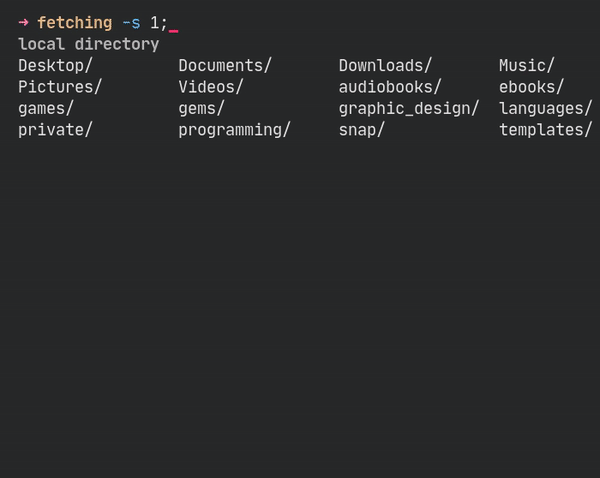
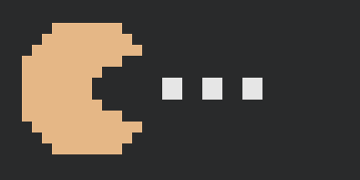

<h1 align="center">
    
  <br>
	<br>
	Fetching
</h1>
<p align="center"><strong>A collection of <i>fetching</i> unicode art for the terminal.</strong></p>

> You have to be in a state of play to design. If you're not in a state of play, you can't make anything.
>
> \- Paula Scher

The goal is to add a touch of beauty to your terminal, and trigger a sense of play.



The art is **colored according to your terminal color theme**. The output can have a different personality depending on your color theme.


The included image scripts are **responsive to the terminal window**. This prevents distorted output in the random and slideshow modes. 🕶️



There are **22 image scripts included** inspired by:

- abstract art, particularly the [De Stijl movement](https://en.wikipedia.org/wiki/De_Stijl) with its simplified forms and limited palette

- street art

  

- computer games, particularly from the 1980's and 1990's
- star wars

I have a list of more images I would like to add (in *todo.md*). I will work through this when the mood strikes me!

## Installation

```bash
git clone https://github.com/robole/fetching
cd fetching
bash install.sh
```

 <u>Usage</u>: `bash install.sh [OPTION]`

|  OPTIONS:           | |
|:--------------------|:-------------|
|-d, --dest           | Specify destination directory (Default: `$HOME/.local/bin`)|
|-h, --help           | Show this help|

> Note: The default installation location may not be on your [`PATH`](https://opensource.com/article/17/6/set-path-linux). You can run fetching from any folder on your system, all this script does is move the files to a "sane" executable location.

If you want to uninstall, run `bash uninstall.sh` with the same destination directory that you provided on installation.

## Usage

<u>Usage</u>: `fetching [OPTION] [SCRIPT NAME/INDEX/NUMBER OF SECONDS]`

|  OPTIONS:           | |
|:--------------------|:-------------|
| -h, --help, help|Print the help page.  |
| -l, --list, list    | List all available scripts.|
| -r, --random, random | Show a random image. It only picks image that fit within the terminal window.|
| -e, --exec, exec     | Show an image by SCRIPT NAME or INDEX. |
| -s, --slideshow, slideshow |	Run a slideshow showing a new image every NUMBER OF SECONDS. It is responsive to the terminal width.|
| -w, --width, width | Show the terminal width. It is shown as a size e.g 'xs' for extra small,and as a width in columns. This can be used to grade the size of the output of your scripts.|

The most common scenarios are:
1. The command `fetching -l` will show you all the available images to show (scripts to run). You can run an image by index: `fetching -e 4` to show the 4th image from the list, or by name `fetching -e mario-xs`.
1. I put the following command `fetching -r` in my `.bashrc` and `.zshrc` files to show a random image every time I open a new terminal.
1. If you want to run a slideshow that cycles through images every 3 seconds, you can run `fetching -s 3`.
  

## Contribute

If you have a suggestion, find a bug, or have made some image scripts that you would like to share (see [*Make your own art* section](#make-your-own-art)), feel free to open an issue.

I am bit fussy about what image scripts I would include, so it's prob best to ask before you make a PR.

## Appreciate

You can show your appreciation by:
1. [Buying me a coffee or sponsoring me](https://ko-fi.com/roboleary)
1. Starring the repo 🌟.

This will **help other people find this** and will **offer me encouragement** to make more.

Thank you! 🙏

## Make your own art

You can use the `template` script in the root folder to get started quickly on your own creation.

There are approxmiately 143,859 unicode characters. You can use any of those, search through [the list](https://en.wikipedia.org/wiki/List_of_Unicode_characters)) to find different ones!

I mostly used the [Block Elements character set](https://en.wikipedia.org/wiki/Block_Elements) (as below) in my art, but I am interested to try out more.

```
█ ▉ ▊ ▋ ▌ ▍ ▎ ▏▐ ▕ ▇ ▆ ▅ ▄ ▃ ▂ ▁  ■ ▄ ▀  ▬ ▓ ▒ ░ 
```

I included a wider selection of symbols as a comment in `template` to get you started.

The script has the color variables to set colors for the background and foreground. You can use these together with `cat` to create your own masterpiece.

For example, this code:


produces this output:



The `rt` variable is used to reset the current color to the default text color. <u>You should use always use `rt` at the end of your output text</u>, so it doesn't affect the text in your terminal after the script is run!

You will notice that all image scripts have a *naming convention*. **The size is added as a postfix to enable the responsive behaviour** e.g. `mario-xs`. To find the width of the output, run your image script and reduce the width of the terminal until the output becomes distorted. You can run the command `fetching -w`to see what the current terminal size is. Set the name of the script based on this. Ensure that the output width does not exceed the range of that size. The sizes are: xs, s, m, l, and xl. I will see if I can do something to automate this process.

## Rendering differences between terminals

I noticed that some terminals show the unicode output from the script with gaps. You can see Alacritty previously did this (bottom left in screenshot below).


I am not sure why it is. It is specific to the terminal app.

Generally, I would **recommend using a monospace font** for best results.

## Credit

- The original idea probably came from [this discussion on crunchbang](https://crunchbang.org/forums/viewtopic.php?id=13645).
- Derek Taylor's [Shell Color Scripts](https://gitlab.com/dwt1/shell-color-scripts) was a source of inspiration for a few scripts.
